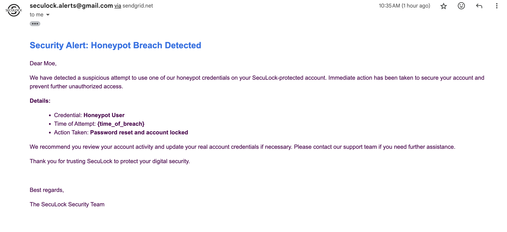

# SecuLock



SecuLock is a cybersecurity project designed to deploy honeypot credentials across multiple platforms and monitor them for breach attempts. When a honeypot credential is used, SecuLock initiates an automated incident response, which includes password rotation, sending breach notifications via email and push notifications, and logging the breach event.

## Features
- Deploy honeypot credentials to **Google Drive**, **Dropbox**, and other platforms.
- Monitor honeypot credentials for breach attempts.
- Incident response includes:
  - Automated password change for real accounts.
  - Sending alerts via **email** (SendGrid) and **Pushbullet** notifications.
  - Logging breach events with geolocation details.
- Expandable with more platforms and security services.

---

## Prerequisites

Before you begin, ensure you have the following installed on your system:

- **Python 3.x**
- **Git** for cloning the repository
- **Docker** (if you want to use Docker)
- **SendGrid** account for email notifications
- **Dropbox** API key
- **Pushbullet** API key
- **Google Cloud** account with Google Drive and Gmail API enabled

---

## 1. Automated Setup with `setup_seculock.sh`

SecuLock includes an automated setup script called `setup_seculock.sh` that will handle most of the setup process for you, including cloning the repository, setting up a virtual environment, installing dependencies, and configuring the environment.

### Step 1: Clone the Repository and Run the Setup Script

Run the following commands to clone the repository and run the automated setup:

```bash
git clone https://github.com/yourusername/seculock.git
cd seculock
chmod +x setup_seculock.sh
./setup_seculock.sh


2. Running the SecuLock Project
Once the setup is complete, you can run SecuLock by activating the virtual environment and executing the main script:
source .venv/bin/activate
python main.py

3. Docker Support (Optional)
SecuLock can also be run inside a Docker container. During the setup process, the script will ask if you want to build and run the Docker container. If you select "yes," the following steps will be executed automatically:
Build and Run the Docker Image
In the root directory of the project, you can build and run the Docker container manually if you choose not to run it during the setup script:
docker-compose up --build

4. Logs
SecuLock logs all breach attempts and incident responses in the logs/breach_logs.log file.

To view the logs, run the following command:
cat logs/breach_logs.log

Troubleshooting
Common Errors:
403 Forbidden Error on Email Sending:
Ensure your SendGrid API Key is correct and that the from_email is verified.
OAuth Authentication Issues:
Make sure your Google OAuth credentials are set up correctly and client_secrets.json is in the root directory.


5. Contributing
We welcome contributions! If you’d like to contribute to SecuLock, please follow these steps:

Fork the repository.
Create a new branch for your feature/bugfix.
Make your changes and submit a pull request.

6. License
This project is licensed under the MIT License - see the LICENSE file for details.